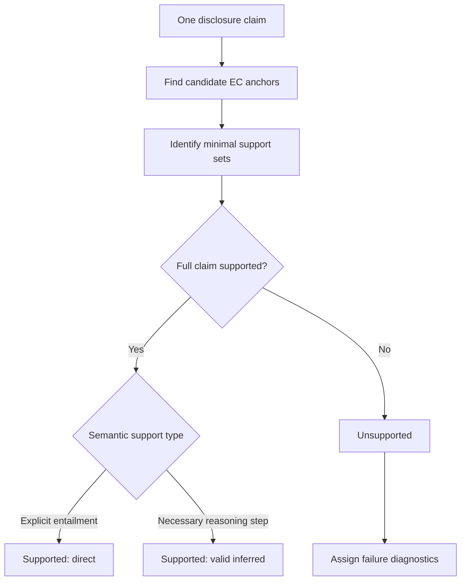

# Generation Evaluation Framework

## 1. Purpose

This document defines the canonical generation evaluation framework for the thesis. The framework evaluates one generated sustainability disclosure at a time by reconstructing the claim-level support relationship between the evidence supplied to the generator and the claims produced in the disclosure.

The central question is:

> Given the evidence available to the generator, which disclosure claims are fully supported, how are they supported, how much of the supplied evidence is used, and what went wrong when a claim is unsupported?

The framework does not require a reference disclosure. It evaluates the generated disclosure against the retrieved evidence that was actually supplied for that generation case.

## 2. Evaluation unit and evidence boundary

The evaluation unit is one **generation case**, consisting of:

- one generated disclosure;
- the complete set of retrieved evidence cards supplied to the generator;
- the task definition and case metadata, including company and target reporting year.

These inputs do not have equal evidentiary status:

- the retrieved evidence is the only source that may provide factual support for a DC;
- all retrieved evidence cards supplied in the generation prompt are processed into the Evidence Claim Set, without a second task-relevance or usability filter;
- the task definition is retained because it defines and identifies the generation task and supports later aggregation and interpretation, but it does not determine EC membership or the Evidence Claim Coverage denominator;
- EC construction receives the complete prompt-visible Evidence section together with the prompt-visible company name, target reporting year, and task title; only the records' `Text:` content asserts evidence facts, while the metadata provides shared interpretive context;
- DC construction receives the generated disclosure together with the company name and target reporting year for bounded reference resolution;
- candidate selection receives only deduplicated EC and DC texts;
- support assessment receives the candidate EC texts, the DC text, and the shared company name and target reporting year. This context may help interpret an explicit claim, but it does not independently support a factual proposition.

The EC extractor therefore receives the evidence records in the same order, labels, and presentation used in the recorded generation prompt, plus only the prompt-visible metadata needed for shared context. It resolves references from the complete supplied input when the interpretation is explicit and unambiguous. If no unique specific referent can be established, it uses a faithful non-specific description rather than guessing a named referent or omitting the substantive claim.

The supplied evidence forms a **closed evidence universe** for generation evaluation. A disclosure claim is not treated as supported merely because it may be true in the real world or verifiable from an external source. It must be supported by the evidence supplied in that generation case.

This boundary separates generation evaluation from external fact-checking. The framework asks whether the generator remained within and made appropriate use of its supplied evidence, not whether the company-level statement is globally true.

## 3. Core representation

For each generated disclosure $d$, two deduplicated atomic claim sets are constructed.

### 3.1 Evidence Claim Set

$$
E_d = \{EC_1, EC_2, \ldots, EC_m\}
$$

The **Evidence Claim Set** contains all atomic factual claims extracted from the complete set of retrieved evidence cards supplied to the generator.

Each evidence claim must be:

- atomic: it expresses one independently evaluable factual proposition;
- maximally self-contained within the prompt-visible evidence context;
- semantically deduplicated across the supplied evidence;
- linked to its complete provenance.

EC extraction is performed once per generation case. The extractor receives the Evidence section copied from the recorded generation prompt, preserving its group headings, card order, prompt labels, source labels, and retrieval text. It also receives the company name, target reporting year, and task title in the same metadata form used by generation. The remaining generation instruction is excluded to avoid task-directed extraction bias.

The complete supplied input may clarify context, but every extracted claim is attributed to exactly one labeled evidence card whose `Text:` directly asserts it. Every claim includes exact source quotes from its attributed card. The extraction response uses prompt labels only; the script validates all labels and quotes and then deterministically restores hidden evidence-card IDs and provenance.

Self-containment is bounded by the supplied context. The extractor must preserve all explicit entities, periods, scopes, units, modalities, and qualifiers. It must also carry applicable headings or repeated context when these are visible and unambiguous. A resolvable reference is replaced by its explicit referent; an unresolvable reference is represented faithfully and non-specifically. An actor, expansion, period, or scope absent from the complete supplied input is not invented and is not treated as extractable information that was lost.

EC membership is determined by whether the supplied text expresses an atomic factual proposition, not by whether the claim is relevant to the generation task or judged usable by the retrieval evaluation. Therefore:

- every supplied evidence card is processed during EC construction;
- every extractable atomic factual claim enters $E_d$;
- Contribution, Usability, and task-relevance labels do not remove claims from $E_d$;
- fragments or extraction noise that cannot express an evaluable factual proposition produce no EC, but this is a claim-construction outcome rather than relevance filtering.

Deduplication is performed within one generation case. It removes repeated claims from that case's evaluation denominator, but it must not erase source information. Each deduplicated EC therefore retains all originating evidence-card IDs and all corresponding source occurrences or text spans.

### 3.2 Disclosure Claim Set

$$
D_d = \{DC_1, DC_2, \ldots, DC_n\}
$$

The **Disclosure Claim Set** contains the atomic claims extracted from the generated disclosure.

Each disclosure claim must likewise be atomic, maximally self-contained within its supplied context, and semantically deduplicated. Qualifiers that affect meaning—such as entity, year, scope, status, certainty, quantity, and causal language—must remain part of the claim.

DC deduplication is likewise performed only within one generation case. Each DC retains the identifier of its originating generated disclosure and its original occurrence location or text span. If semantic deduplication merges repeated expressions of the same claim within a disclosure, all occurrences are preserved in the DC provenance.

After claim construction, every EC and DC must be interpretable for support assessment without hidden access to the task definition, provenance, or evidence-card metadata. The support judge receives only the claim texts and the prompt-visible company and reporting-year context described above.

### 3.3 Atomicity principle

A claim is atomic when it can receive one coherent support verdict. If different factual components could be supported by different evidence or could receive different verdicts, they must be separated.

Atomic segmentation is shared preprocessing for the entire framework. All later support, coverage, inference, and failure metrics depend on the resulting EC and DC sets.

## 4. Evidence–Disclosure Claim Support Graph

The relationship between evidence and disclosure claims is represented as a bipartite support graph:

$$
G_d = (E_d, D_d, A_d)
$$

where $A_d$ is the set of support edges between ECs and DCs.

An edge

$$
(EC_i, DC_j) \in A_d
$$

means that $EC_i$ makes an actual evidential contribution to the support assessment of $DC_j$. Topical similarity alone is not sufficient to create a support edge.

For every disclosure claim, the evaluation identifies zero or more support sets:

$$
\mathcal{S}(DC_j) = \{S_1, S_2, \ldots, S_k\}, \qquad S_r \subseteq E_d
$$

Every returned $S_r$ must be a **minimal sufficient support set**: it supports the full factual meaning of the DC, and removing any member makes it insufficient. Distinct alternative minimal sets are retained. If no sufficient set exists, $\mathcal{S}(DC_j)$ is empty. This prevents irrelevant or merely similar evidence from being counted as support.

Candidate anchors may be retrieved by similarity or other matching methods, but only ECs that contribute to the final support determination become supporting anchors in the graph.

Candidate selection is based exclusively on the semantic content of the deduplicated ECs and DCs. Support assessment additionally receives the prompt-visible company name and target reporting year as shared interpretive context. Neither stage receives the task definition, provenance, evidence-card identifiers, source spans, retrieval scores, or other hidden case metadata, and shared context must not be used as an additional factual premise.

## 5. Evaluation procedure

Each disclosure claim is evaluated independently through the following sequence.

### Step 1: Find EC anchors

Search the Evidence Claim Set for one or more claims that are potentially relevant to the DC. An anchor must match the factual content and its material boundaries, not only the general topic.

### Step 2: Determine the support structure

Record the cardinality of each minimal sufficient support set separately from its semantic support type:

- **single EC**: the support set contains one EC;
- **multiple ECs**: the support set contains two or more ECs;
- **no sufficient support set**: candidate ECs may exist, but none of their minimal combinations entails the complete DC;
- **no candidate anchor**: candidate selection finds no EC that materially bears on the DC.

`Single EC` and `multiple ECs` are structural properties. They do not determine whether support is direct or inferred. `No candidate anchor` is an alignment outcome and deterministically produces no support set, while a non-empty candidate set may still produce no sufficient support set.

### Step 3: Evaluate full-claim support

The complete semantic content of the DC is evaluated against each proposed support set. Partial support is not sufficient. Every material component and qualifier must be supported, including:

- entity or organizational level;
- reporting period, baseline year, and target year;
- geography or business unit;
- metric value, unit, and measurement boundary;
- activity, policy, target, or implementation status;
- certainty, modality, and commitment strength;
- comparison, trend, attribution, and causal relationship.

### Step 4: Assign the support verdict

Each DC receives exactly one primary verdict:

- `supported_direct`;
- `supported_inferred`;
- `unsupported`.

A DC is `supported_direct` when at least one returned minimal sufficient set is classified as direct. It is `supported_inferred` when support sets exist and all of them require inferred support. It is `unsupported` when no support set is returned.

### Step 5: Diagnose unsupported claims

If and only if the primary verdict is `unsupported`, one or more unsupported failure tags are assigned. These tags explain the mechanism of failure and are not mutually exclusive.

## 6. Primary support verdicts

### 6.1 Supported: direct

A DC is **directly supported** when a minimal evidence set explicitly entails the complete factual content of the DC without requiring a substantive reasoning step or introducing a new characterization, attribution, relationship, or strengthening of meaning.

Minor linguistic reformulation, compression, or stylistic normalization does not turn direct support into inference, provided the factual meaning remains unchanged.

### 6.2 Supported: valid inferred

A DC has **valid inferred support** when its complete factual meaning follows from a minimal evidence set through a necessary reasoning step. The inference must follow from the stated propositions without adding or recharacterizing a substantive fact.

Example:

- EC1: Scope 1 emissions were 120 tonnes in 2022.
- EC2: Scope 1 emissions were 100 tonnes in 2023.
- DC: Scope 1 emissions decreased between 2022 and 2023.

The DC introduces a comparison, but the comparison follows directly from the two supplied values. It is therefore a valid inference, not inferential inflation.

Valid inference is a legitimate part of disclosure generation. The framework does not assume that lower inference is inherently better.

Support-set cardinality and semantic support type are independent. A singleton may require inference, while a multi-EC set may directly state complementary parts of the same proposition without introducing a new semantic conclusion.

### 6.3 Unsupported

A DC is **unsupported** when no candidate EC combination entails its complete factual meaning, when a material component exceeds the evidence, or when the supplied evidence supports an incompatible proposition.

A claim remains unsupported even if:

- part of the claim is supported;
- the claim is plausible;
- the claim is common knowledge;
- the claim may be true outside the supplied evidence;
- semantically similar evidence exists but does not establish the claim.

## 7. Unsupported failure diagnostics

Unsupported diagnostics are multi-label. A single unsupported DC may receive more than one tag when several mechanisms jointly explain the failure.

### 7.1 Unsupported novelty

The DC introduces factual content for which no supporting information exists in the supplied evidence and which cannot be reasonably derived from it.

This is the clearest form of extrinsic unsupported content. It normally occurs with no meaningful anchor, although a claim may combine an anchored component with additional unsupported novelty.

### 7.2 Inferential inflation

Relevant EC anchors exist, but the DC draws a conclusion stronger, broader, more certain, more complete, or more consequential than the evidence permits.

Typical forms include:

- turning an intention into an established plan;
- turning a pilot activity into organization-wide implementation;
- turning an association into causation;
- turning partial progress into target achievement;
- turning tentative language into certainty;
- claiming effectiveness when evidence shows only activity or expenditure.

Inferential inflation differs from valid inferred support because the inference is not fully authorized by the evidence.

### 7.3 Factual boundary distortion

The DC is based on recognizable evidence content but changes one or more boundaries that determine where, when, or to what the fact applies.

Relevant boundaries include:

- legal entity or organizational level;
- reporting year, baseline year, or target year;
- geography, facility, or business unit;
- operational or emissions scope;
- population or product coverage;
- metric definition, unit, or measurement boundary;
- status, completion level, or implementation stage;
- certainty or commitment boundary.

The problem is not necessarily that the underlying fact was invented, but that it was transferred beyond its evidenced boundary.

### 7.4 Contradiction

The supplied evidence supports a proposition that is incompatible with the DC. Contradiction is stronger than absence of support: the evidence provides affirmative grounds against the generated claim.

Contradiction remains distinct from boundary distortion because it captures direct semantic opposition, including reversed trends, incorrect comparisons, incompatible values, and negated or opposite statuses.

### 7.5 Evidence conflation

The DC combines individually valid elements from different ECs into a relationship, attribution, entity, event, or conclusion that the evidence does not establish.

Typical forms include:

- assigning one business unit's policy to the whole group;
- attaching one year’s target to another year’s performance;
- combining an action and a later outcome into an unsupported causal claim;
- merging facts about different scopes, facilities, metrics, or initiatives.

Evidence conflation often co-occurs with inferential inflation or factual boundary distortion. It describes how evidence elements were incorrectly combined rather than serving as an exclusive truth-status category.

## 8. Core metrics

All primary metrics are calculated first at the disclosure level. Dataset-level reporting should preserve the distribution across generation cases rather than relying only on pooled claim counts.

### 8.1 Disclosure Claim Support Rate

$$
DCSR_d =
\frac{N_{direct,d} + N_{inferred,d}}{|D_d|}
$$

This is the main generation-side support metric. It measures the proportion of deduplicated disclosure claims that are fully supported by the supplied evidence.

The two supported components must also be reported separately:

$$
DirectSupportRate_d = \frac{N_{direct,d}}{|D_d|}
$$

$$
ValidInferredSupportRate_d = \frac{N_{inferred,d}}{|D_d|}
$$

Separating them distinguishes disclosures that primarily restate evidence from disclosures that validly synthesize it.

### 8.2 Evidence Claim Coverage Rate

Evidence Claim Coverage Rate is:

$$
ECCR_d =
\frac{
|\{EC_i \in E_d: \exists DC_j, (EC_i,DC_j) \in A_d\}|
}{|E_d|}
$$

It measures the proportion of all deduplicated Evidence Claims supplied to the generator that contribute to at least one Disclosure Claim.

No task-relevance or usability screening is applied to the denominator. Task relevance and evidence-card usability are already evaluated in the separate retrieval evaluation through the Contribution and Usability dimensions. Reapplying those judgments here would duplicate retrieval evaluation and blur the boundary between retrieval and generation analysis.

ECCR is therefore a **supplied-evidence utilization diagnostic**, not a monotonic generation-quality score. A low value may reflect irrelevant or unusable retrieval results, generator underuse of useful evidence, disclosure-length constraints, peripheral evidence, or the fact that a small subset of claims was sufficient for the task. These explanations should be investigated by combining generation results with the separate retrieval-evaluation outputs rather than by changing $E_d$ or the ECCR denominator.

Because every EC retains evidence-card provenance, supplementary cross-layer analyses may stratify EC utilization by the originating cards' Contribution and Usability labels. These retrieval labels are used only for post hoc interpretation; they never determine EC membership, support edges, or the ECCR denominator.

## 9. Relationship-structure diagnostics

These diagnostics describe how the generator uses evidence. They are not inherently quality scores and must not be interpreted as monotonically better or worse.

### 9.1 Inference Rate

Inference Rate is calculated among supported disclosure claims:

$$
InferenceRate_d =
\frac{N_{inferred,d}}
{N_{direct,d}+N_{inferred,d}}
$$

It measures how often successful support depends on valid synthesis rather than direct restatement.

Unsupported inferential inflation is excluded from this rate and reported separately as a failure diagnostic.

### 9.2 Evidence reuse

For each EC:

$$
\deg(EC_i)=|\{DC_j:(EC_i,DC_j)\in A_d\}|
$$

Evidence reuse can be summarized through:

- mean, median, and maximum EC degree;
- the proportion of used ECs supporting more than one DC:

$$
ReuseRate_d =
\frac{|\{EC_i:\deg(EC_i)>1\}|}
{|\{EC_i:\deg(EC_i)>0\}|}
$$

Reuse is not automatically a failure. A central evidence claim may legitimately support several distinct disclosure claims. The diagnostic becomes informative when interpreted together with claim redundancy, disclosure length, and evidence concentration.

### 9.3 Evidence concentration

Evidence concentration measures whether support edges are broadly distributed across used ECs or concentrated on a small number of claims.

Let:

$$
p_i = \frac{\deg(EC_i)}{\sum_k \deg(EC_k)}
$$

Then an HHI-style concentration measure is:

$$
Concentration_d = \sum_i p_i^2
$$

A higher value indicates greater dependence on a small number of evidence claims. This is descriptive, not automatically negative. Interpretation must consider the size and diversity of the complete supplied EC set and the nature of the task.

## 10. Unsupported diagnostic rates

For each unsupported failure type $f$, report its disclosure-claim prevalence:

$$
FailureRate_{f,d} =
\frac{|\{DC_j \in D_d : f \in Tags(DC_j)\}|}{|D_d|}
$$

It may also be useful to report composition among unsupported DCs:

$$
UnsupportedComposition_{f,d} =
\frac{|\{DC_j : f \in Tags(DC_j)\}|}{N_{unsupported,d}}
$$

Because tags are multi-label, unsupported composition values do not need to sum to one.

The primary quality result remains the support verdict. Failure rates are diagnostic explanations of unsupported generation, not competing top-level evaluation systems.

## 11. Required claim-level output record

The evaluation output must preserve enough structure for audit, aggregation, and error analysis.

The case-level record should retain `case_id`, `task_id`, task definition, company, target reporting year, workflow, model, evidence condition, and `generated_disclosure_id`. These fields support case identification, aggregation, stratification, interpretation, and audit. Their presence does not make them evidence: only company and target reporting year are supplied to the support judge, and only as shared interpretive context.

At minimum, every DC record should contain:

| Field | Description |
|---|---|
| `case_id` | Generation-case identifier |
| `generated_disclosure_id` | Identifier of the disclosure from which the DC was extracted |
| `dc_id` | Disclosure-claim identifier |
| `dc_text` | Atomic disclosure claim, maximally self-contained within its supplied context |
| `dc_provenance` | All original occurrences or text spans within the generated disclosure |
| `candidate_ec_ids` | ECs considered during anchor search |
| `support_sets` | Zero or more minimal sufficient sets, each containing `ec_claim_ids` and semantic `support_type` |
| `supporting_ec_ids` | Union of ECs appearing in at least one support set |
| `support_structure` | Cardinality of each support set (`single_ec` or `multiple_ecs`), or no sufficient set |
| `support_verdict` | Derived as `supported_direct`, `supported_inferred`, or `unsupported` |
| `unsupported_tags` | Zero or more unsupported diagnostic labels |
| `rationale` | Concise justification referencing factual boundaries and support gaps |

Every EC record should contain:

| Field | Description |
|---|---|
| `case_id` | Generation-case identifier |
| `ec_id` | Deduplicated evidence-claim identifier |
| `ec_text` | Atomic evidence claim, maximally self-contained within the prompt-visible evidence context |
| `evidence_card_ids` | All evidence cards from which the deduplicated EC originated |
| `ec_provenance` | Structured mapping from each originating evidence-card ID to its source location, original occurrence, or text span |
| `supported_dc_ids` | DCs to which the EC contributes |

The graph edges should be recoverable directly from `supporting_ec_ids` and `supported_dc_ids`.

Claim-source provenance and EC–DC support edges are distinct relationships. Provenance records where a claim originated; support edges record which ECs actually support which DCs. An unused EC retains its evidence-card provenance, and an unsupported DC retains its generated-disclosure provenance even when neither participates in a support edge.

## 12. Aggregation and reporting

The disclosure is the primary evaluation unit. For each experimental condition, report at least:

- number of evaluated disclosures and DCs;
- mean and distribution of Disclosure Claim Support Rate;
- direct and valid inferred support rates;
- mean and distribution of Evidence Claim Coverage Rate;
- Inference Rate;
- evidence reuse and concentration diagnostics;
- prevalence of each unsupported failure type;
- counts of claims with no anchor, single-EC support, and multiple-EC support.

Macro-averaging across disclosures should be the main comparison because it gives each generated disclosure equal weight. Pooled claim-level micro-averages may be reported as supplementary results, but they give greater influence to disclosures that contain more atomic claims.

Results should be stratifiable by relevant experimental dimensions, including workflow, task, company, target year, and evidence condition.

## 13. Validation requirements

The framework relies on structured judgments and therefore requires validation at the key stages.

### 13.1 Claim construction validation

Validate a sample of EC and DC decompositions for:

- atomicity;
- preservation of qualifiers;
- bounded self-containment quality;
- semantic deduplication;
- provenance preservation;
- stability across repeated runs.

### 13.2 Support judgment validation

Human validation should independently assess a sample of:

- selected support sets;
- direct versus inferred support;
- full-claim support verdicts;
- unsupported diagnostic tags.

Agreement should be reported separately for the primary support verdict and the multi-label unsupported diagnostics. Disagreements in anchor selection should also be examined, because a correct-looking verdict can still be based on an incorrect support path.

Validation must also confirm input isolation: the support judge should receive only the EC and DC texts plus company and target reporting year as shared interpretive context. It must not receive task definitions, provenance, evidence-card metadata, or other context that could fill evidentiary gaps, and the permitted context must not independently establish a factual proposition.

### 13.3 Guard against similarity-based support

The evaluation must explicitly prevent topic overlap or lexical similarity from being treated as evidential support. A supporting anchor must establish part of the proposition, and the selected support set must collectively establish the entire DC.

## 14. Interpretation boundaries

The framework supports the following interpretations:

- **DCSR** evaluates factual support from the disclosure side.
- **ECCR** evaluates utilization of the complete supplied Evidence Claim Set from the evidence side.
- **Inference Rate** distinguishes synthesis from direct restatement among supported claims.
- **Reuse and concentration** describe the structure of evidence use.
- **Unsupported tags** identify mechanisms that produced unsupported claims.

The framework does not by itself evaluate:

- external real-world truth beyond the supplied evidence;
- stylistic quality, readability, or ESRS writing quality;
- regulatory completeness against all information a company should disclose;
- retrieval quality; ECCR may be interpreted jointly with retrieval-evaluation results but does not itself replace them;
- whether omitted evidence was material in an external legal or assurance sense;
- whether one unique reference disclosure has been reproduced.

These boundaries are necessary to keep the generation evaluation attributable to the generator and interpretable within the experiment.

The inclusion of task definition and case metadata in the wider evaluation pipeline does not change the closed evidence boundary. The EC extractor receives only the prompt-visible company name, target reporting year, and task title alongside the exact Evidence section; the DC extractor and support judge receive only company name and target reporting year. These fields provide bounded interpretive context and cannot fill factual gaps in the supplied evidence. Other metadata remains limited to deterministic provenance restoration, aggregation, stratification, interpretation, and audit. None of it changes EC membership, the ECCR denominator, or factual support.

## 15. Methodological positioning

The framework belongs to the broader family of atomic-claim factuality, entailment-based faithfulness, claim–source attribution, and claim-level RAG evaluation methods. Its distinctive unit of analysis is an explicit, two-sided Evidence–Disclosure Claim Support Graph for long-form corporate disclosure generation.

Its methodological contribution is the joint treatment of:

1. disclosure-side claim support;
2. evidence-side utilization of the complete supplied Evidence Claim Set;
3. direct versus valid inferred support, independently of support-set cardinality;
4. evidence reuse and concentration structure;
5. multi-label diagnosis of unsupported synthesis;
6. evaluation without a reference disclosure.

The framework should therefore be described as an extension and integration of established claim-level evaluation principles, not as the first use of atomic claims, entailment judgments, evidence utilization, or multi-source support.

## 16. Canonical summary

For each generated disclosure:

1. Convert supplied evidence into a deduplicated Evidence Claim Set while preserving provenance.
2. Include every extractable atomic factual claim from every supplied evidence card; do not filter ECs by task relevance, Contribution, or Usability.
3. Convert the generated disclosure into a deduplicated Disclosure Claim Set while preserving its provenance to the generated disclosure.
4. Extract ECs once per case from the exact prompt-visible Evidence section plus its prompt-visible company, reporting-year, and task-title context; attribute each EC to one labeled card without using hidden metadata or adding factual content.
5. For every DC, select materially relevant candidate ECs from the complete case EC set using only EC and DC semantics.
6. Identify every minimal sufficient support set from the candidates, using company and reporting year only as shared interpretive context.
7. Record support-set cardinality separately from whether each set provides direct or inferred semantic support, then derive the DC-level verdict.
8. Apply one or more failure diagnostics to unsupported DCs.
9. Construct the EC–DC support graph while keeping claim-source provenance separate from support edges.
10. Calculate disclosure support, full-set evidence claim coverage, inference, reuse, concentration, and unsupported diagnostic rates.
11. Use prompt-visible metadata only within its stated extraction and interpretation boundaries; use all other task and case metadata only for case identification, deterministic provenance restoration, aggregation, stratification, interpretation, and audit.
12. Aggregate first at the disclosure level and then compare experimental conditions.

The framework's organizing principle is:

> Generation evaluation is a two-sided reconstruction of how supplied evidence claims support generated disclosure claims. Support and coverage are the primary outcomes; inference and evidence-use structure explain how generation occurred; unsupported failure tags explain why it failed.
