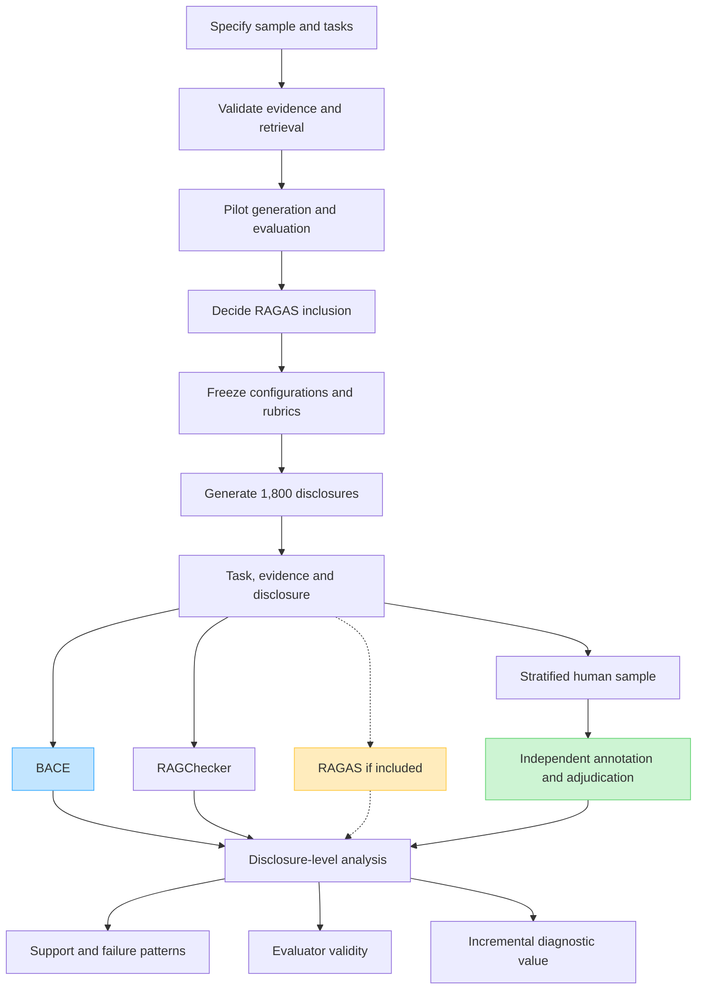
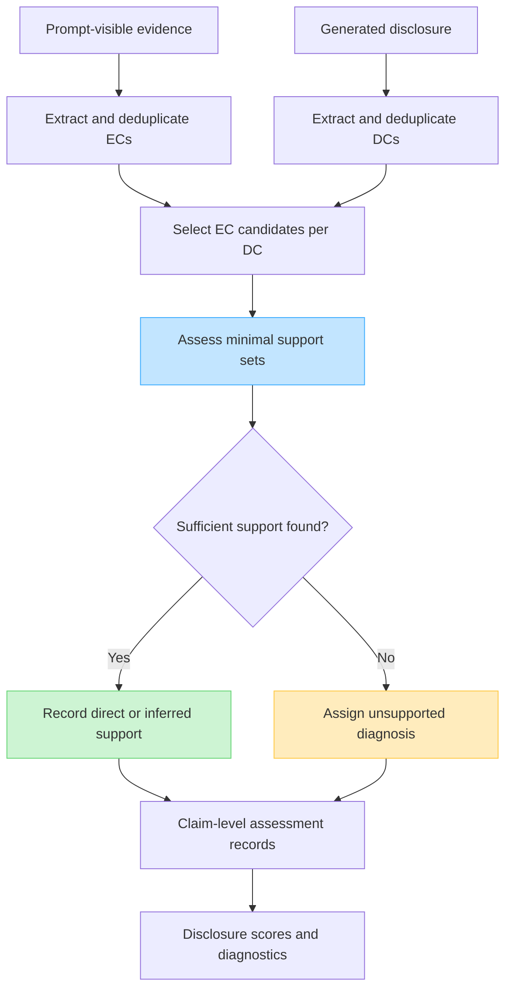

# BACE experiment flow and supported claims

Date: 6 September 2026

This document summarizes the experiment under the agreed focus on evaluation validity and diagnostic value. It follows [Project Framework v2](project_framwork_v2.md) and the methodological positioning in the [Introduction logic chain](introduction/introduction_logic_chain_and_evidence.md). It describes a planned design, not completed experiments or observed findings.

BACE means Boundary-Aware Claim Evaluation. The planned matrix contains 30 companies, five reporting years (2019–2023), and 12 disclosure tasks across ESRS E1, S1 and G1, producing 1,800 disclosures. The exact company sample, S1/G1 tasks, temporal evidence window, human sample size and some supplementary measures still require specification. The historical cases are ESRS-style simulations rather than observations of mandatory ESRS reporting or real AI adoption in those years.

## Overall experimental flow

The pilots include source-extraction and retrieval checks, EC/DC extraction validation, human-rubric calibration, and independent RAGChecker execution. The RAGAS decision is made before examining the full results. The main run repeats the frozen retrieval and generation workflow for each case and preserves the exact prompt-visible evidence.

Every evaluator assesses the same generation cases, using its own defined processing. RAGChecker independently decomposes claims and checks entailment; it receives no BACE verdicts or diagnoses. Its confirmed external metric is faithfulness. Metrics requiring an expert reference answer remain outside the comparison unless that reference is separately constructed.

At least two human annotators independently assess the selected disclosures and supplied evidence, followed by adjudication. Automated scores and disagreement patterns can inform sampling, but the independent annotation pass should not be shown those verdicts. Sample EC/DC extraction and proposed support paths separately to check whether correct-looking scores hide extraction or attribution errors. Report uncertainty and annotator agreement.

Aggregate scores first by disclosure and then across disclosures, accounting for company clustering. Separate claim-segmentation differences from support-judgment differences. Analyze standard, task, company and year variation within the study sample. If disagreement cases are oversampled, distinguish their diagnostic analysis from population prevalence estimates and account for sampling when making overall estimates.

## BACE processing within each case

EC means Evidence Claim; DC means Disclosure Claim. Candidate selection retains evidence that may support, partly support or contradict a DC. Candidate membership is not a support verdict. Each accepted support set must support the complete DC and be minimal; alternative sufficient sets may be retained. Empty candidate sets receive an empty support-set result without a support-model call.

Unsupported diagnosis uses the DC and candidate ECs. Its exclusive labels are non-disclosure statement, contradiction, evidence conflation, factual boundary distortion, inferential inflation and unsupported novelty. Non-disclosure statements receive separate sensitivity analysis.

Support assessment uses claim texts and the permitted company/year context. Provenance is retained for audit but does not supply hidden factual premises to the support judge. Minimality and sufficiency are model judgments requiring validation.

BACE outputs the Disclosure Claim Support Rate (DCSR), direct/inferred/unsupported shares, failure composition and support sets. Its evidence-side diagnostics include Evidence Claim Coverage Rate (ECCR), reuse and concentration. ECCR describes utilization of the supplied EC set; it does not measure ESRS completeness and is not inherently better when higher. Task relevance, task coverage and severity require separate rubrics whose definitions remain pending.

## What the results can establish

| Result, if observed and validated | Supported interpretation | What it does not establish |
|---|---|---|
| Generated claims exceed supplied evidence, including temporal, entity, scope or status changes | Evidence access does not guarantee supported disclosure in the tested workflow; post-generation assessment has a concrete target | BACE is the only adequate evaluator, or RAG is worse than another architecture |
| BACE extraction, support judgments, support sets and diagnoses agree sufficiently with independent human assessment | BACE provides valid measurements for the assessed constructs and sampled cases | Correctness on every case, external truth, or legal compliance |
| Automated evaluators agree and also perform well against human judgments | Convergent and criterion-related evidence supports their use in this setting | BACE superiority or a unique need for its implementation |
| Humans confirm cases that BACE judges correctly and a comparator misjudges, with false positives also assessed | BACE provides incremental detection value for the demonstrated failure types | That every disagreement favours BACE or that a particular component caused the gain without an isolating comparison |
| Humans confirm BACE's support paths and failure explanations beyond a shared support verdict | BACE supplies additional validated diagnostic information | Improved reviewer accuracy or speed without a review experiment |
| Performance and recurring mechanisms are consistent across sampled standards and tasks | Evidence of transfer within the studied contexts | Universality across companies, models, jurisdictions or reporting requirements |

The experiment tests these interpretations rather than guaranteeing them. Agreement between BACE and RAGChecker alone does not show which evaluator is correct. Different scores alone do not show incremental value. Human validation must resolve the substantive judgment, and failures must be reported alongside successes.

The methodological argument has three distinct levels:

1. Need for assessment: demonstrate real support failures in the generated disclosures.
2. Validity of BACE: establish that its representations and judgments measure the intended support relationships.
3. Incremental value: establish additional correct detection or validated diagnostic information relative to the selected comparators.

Current scope does not establish whether BACE improves human review, whether AI systematically makes companies appear more sustainable, or whether generated text causes investment or environmental effects. Those require additional outcome definitions and experiments. RAGChecker and RAGAS already contain claim-level checks, so the comparison concerns the value of BACE's explicit support reconstruction and boundary-aware diagnosis, rather than the invention or unique necessity of claim-level evaluation.

## Paper-level objective

> This study evaluates the evidentiary reliability of RAG-generated sustainability disclosures and tests the validity and incremental diagnostic value of BACE against independent human judgments and established RAG evaluators.

If BACE and the comparators perform similarly, the paper should report convergence and any independently validated diagnostic contribution. If BACE fails the human benchmark, it requires revision and the study cannot present its uncorrected scores as reliable measurements. Final conclusions must follow the observed results.
