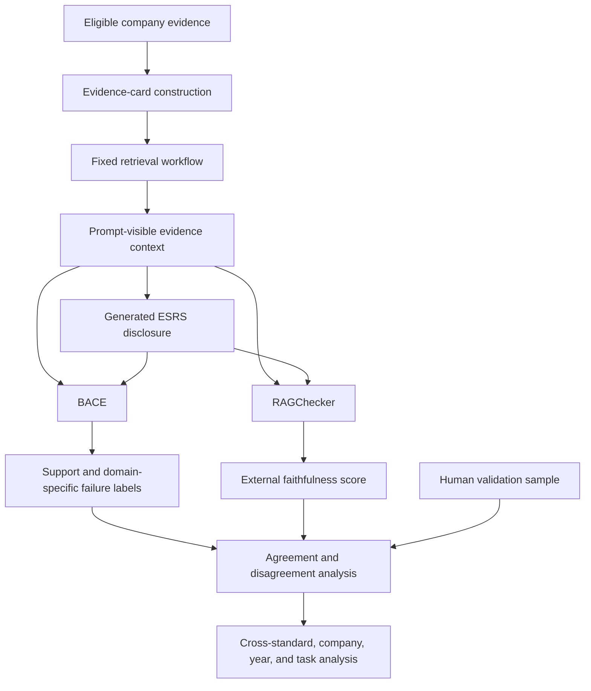

# Project Framework v2

## External Validation of Claim-Level Evidence Support in RAG-Assisted ESRS Disclosure Generation

**Document status:** Study-design draft for decision and implementation planning  
**Target outlet:** *Nature Sustainability*  
**Empirical domain:** Corporate sustainability reporting under the European Sustainability Reporting Standards (ESRS)  
**Standards in scope:** ESRS E1, ESRS S1, and ESRS G1  
**Study design:** Multi-company, multi-year evaluation of one fixed evidence-card retrieval-augmented generation (RAG) workflow  
**Primary evaluation level:** Atomic disclosure claim  
**Project evaluation framework:** BACE (Boundary-Aware Claim Evaluation)  
**Primary external evaluator:** RAGChecker  
**Conditional external evaluator:** RAGAS, to be decided after the RAGChecker pilot  

---

# 1. Purpose of This Document

This document defines the planned second version of the project framework. It extends the existing E1 pilot while preserving its central methodological focus: whether generated sustainability-disclosure claims remain within the factual boundaries of the evidence supplied to the generator.

Version 2 is not designed to compare two RAG architectures. It evaluates one fixed and reproducible evidence-card RAG workflow through:

1. BACE (Boundary-Aware Claim Evaluation), the project's claim-level evaluation framework;
2. an established external RAG evaluation framework, RAGChecker;
3. a stratified human-validation sample; and
4. RAGAS only if it provides non-redundant information after the RAGChecker pilot.

The document separates confirmed design decisions from decisions that must be resolved through pilot evidence.

---

# 2. Confirmed Design Decisions

| Design element | Confirmed decision |
|---|---|
| Paper framing | A research paper designed for *Nature Sustainability*, not a thesis |
| RAG comparison | No comparison between alternative RAG architectures |
| Companies | 30 companies |
| Target reporting years | 2019–2023 inclusive |
| ESRS standards | E1 Climate Change, S1 Own Workforce, and G1 Business Conduct |
| Tasks per standard | Four disclosure tasks |
| Base generation cases | 30 companies × 5 years × 12 tasks = 1,800 cases |
| Generation workflow | One fixed evidence-card RAG workflow |
| Internal evaluation | BACE: boundary-aware Evidence Claim–Disclosure Claim support reconstruction |
| External evaluation | RAGChecker is included |
| RAGAS | Decision deferred until after the RAGChecker pilot |
| Primary aggregation unit | Generated disclosure, not individual claim |
| Human validation | Required for evaluating automated-judge validity; final sample size remains to be determined |

---

# 3. Proposed Paper Positioning

The paper examines a problem that is more specific than general hallucination detection:

> Does access to retrieved corporate evidence ensure that generated environmental, social, and governance disclosures remain within the evidence's factual, temporal, organizational, quantitative, and reporting boundaries?

The study does not claim to invent claim-level factuality evaluation. Established frameworks already evaluate faithfulness, relevance, attribution, and hallucination. The contribution is to test whether a general-purpose RAG evaluator is sufficient for regulated sustainability-report generation and whether a domain-specific, boundary-aware evaluation reveals material failure mechanisms that a generic metric does not capture.

E1 is therefore not the paper's sole substantive focus. It is the environmental component of a broader cross-domain ESRS design. S1 and G1 test whether the evaluation framework and observed failure mechanisms transfer to social and governance disclosures.

---

# 4. Study Objectives

The study has four objectives:

1. quantify the evidentiary support of RAG-generated disclosures across environmental, social, and governance reporting tasks;
2. identify how unsupported claims arise, including evidence conflation, inferential inflation, and factual boundary distortion;
3. externally validate BACE against RAGChecker and human judgments; and
4. test whether support levels, evaluator disagreement, and failure mechanisms vary across standards, task types, companies, and reporting years.

---

# 5. Research Questions

## RQ1 — Evidence support

> To what extent are factual claims in RAG-generated ESRS disclosures supported by the evidence supplied to the generator?

## RQ2 — Failure mechanisms

> Through which mechanisms do generated disclosure claims exceed, distort, or misrepresent the supplied evidence?

## RQ3 — Cross-domain transfer

> How do evidence-support outcomes and failure mechanisms vary across environmental, social, and governance disclosure tasks?

## RQ4 — External validity of the evaluation

> To what extent does BACE agree with RAGChecker and human judgments?

## RQ5 — Domain-specific incremental value

> Which reporting-specific evidentiary failures are detected by BACE but missed or differently classified by a general-purpose RAG faithfulness evaluator?

## RQ6 — Organizational and temporal heterogeneity

> How do disclosure-level support outcomes vary across companies and target reporting years within the study sample?

Company and year comparisons are descriptive or model-based heterogeneity analyses. They are not interpreted as causal company or time effects.

---

# 6. Conceptual Research Logic

The design compares evaluation systems, not generation systems. Every evaluator receives outputs from the same RAG cases.

---

# 7. Empirical Scope and Case Matrix

## 7.1 Companies

The study will include 30 companies. The company-selection protocol must be frozen before the main run and should balance, as far as data availability permits:

- country;
- economic sector;
- company size or reporting maturity;
- availability of annual and sustainability reports for 2019–2023;
- consistency of company identity across source datasets; and
- availability of evidence relevant to E1, S1, and G1.

The selection procedure must be documented sufficiently to distinguish a reproducible stratified sample from a convenience sample. Exclusion reasons must be recorded.

## 7.2 Target reporting years

The target years are 2019, 2020, 2021, 2022, and 2023. These years are historical ESRS-style simulation cases unless the source document is an actual ESRS disclosure. The paper must not imply that all sampled companies were legally subject to ESRS in those years.

The temporal evidence window, treatment of prior-year documents, and rules for future-information exclusion must be specified before retrieval is run.

## 7.3 Standards and tasks

The experiment covers three topical standards:

- **ESRS E1:** Climate Change;
- **ESRS S1:** Own Workforce;
- **ESRS G1:** Business Conduct.

Four tasks will be selected per standard, giving 12 tasks in total. Task selection should represent comparable disclosure archetypes where the standard permits:

1. policy, governance, or strategic commitment;
2. actions, processes, and allocated resources;
3. targets or forward-looking commitments; and
4. quantitative outcomes, incidents, or performance metrics.

The current E1 tasks remain the provisional E1 set:

- E1-1 Transition plan for climate change mitigation;
- E1-3 Actions and resources in relation to climate change policies;
- E1-4 Targets related to climate change mitigation and adaptation; and
- E1-6 Gross Scope 1, Scope 2, Scope 3, and total greenhouse-gas emissions.

The exact S1 and G1 disclosure requirements must be selected and justified before corpus construction. A provisional conceptually matched set is:

| Standard | Policy/strategy | Action/process | Target | Metric/incident |
|---|---|---|---|---|
| E1 | E1-1 | E1-3 | E1-4 | E1-6 |
| S1 | S1-1 | S1-4 | S1-5 | S1-14 or another prespecified workforce metric |
| G1 | G1-1 | G1-3 | A prespecified target-bearing G1 task if empirically defensible | G1-4 or G1-6 |

The final selection should follow substantive comparability, evidence availability, and reporting importance rather than forcing an artificial one-to-one mapping where the standards differ structurally.

## 7.4 Case count

The base factorial design is:

\[
30\ companies \times 5\ years \times 12\ tasks = 1{,}800\ generation\ cases
\]

Each case contains one company, one target year, one ESRS task, one retrieved evidence context, and one generated disclosure.

At the claim density observed in the initial E1 experiment, the expanded design may produce approximately 80,000 atomic disclosure claims. This is a planning estimate rather than a target and makes automated-pipeline validation essential before full-scale execution.

---

# 8. Fixed RAG Workflow

The study evaluates one evidence-card RAG workflow. The retrieval and generation configuration must be frozen before the 1,800-case main run. The frozen specification should include:

- source-document eligibility;
- temporal and organizational boundaries;
- evidence-card schemas for narrative text, table rows, and structured metrics;
- query construction;
- embedding and lexical retrieval models;
- fusion and ranking procedure;
- task-specific or evidence-type selection rules;
- maximum evidence context;
- generation model and deployment version;
- prompt template;
- decoding parameters;
- expected output length; and
- run manifests, hashes, and failure-retry rules.

This study does not estimate the causal effect of RAG or claim that the selected workflow is superior to another retrieval architecture.

---

# 9. Evaluation Architecture

The evaluation contains four layers.

## 9.1 Layer A — Retrieval input quality

Retrieval evaluation determines whether the prompt-visible evidence is relevant and usable for the assigned ESRS task. A human-labelled pilot must be drawn from the same retrieval configuration used in the main generation run.

Core concepts include:

- task contribution;
- evidence usability;
- boundary validity;
- evidence-type distribution; and
- prevalence of irrelevant or corrupted evidence cards.

This layer characterizes the input received by the generator. It does not measure generated-claim support.

## 9.2 Layer B — BACE claim-level evaluation

BACE reconstructs the relationship between Evidence Claims (ECs) and Disclosure Claims (DCs). The complete method is defined in [BACE: Boundary-Aware Claim Evaluation](../generation_evaluation.md). It retains the existing logic:

1. extract atomic ECs from all prompt-visible evidence;
2. extract and deduplicate atomic factual DCs from the generated disclosure;
3. identify candidate evidence for each DC;
4. determine the minimal sufficient EC support set;
5. assign `supported_direct`, `supported_inferred`, or `unsupported`; and
6. assign one exclusive diagnostic label to each unsupported DC.

The provisional unsupported labels are:

- non-disclosure statement;
- contradiction;
- evidence conflation;
- factual boundary distortion;
- inferential inflation; and
- unsupported novelty.

Non-disclosure statements must be reported separately in sensitivity analysis because they are not equivalent to affirmative factual hallucinations.

## 9.3 Layer C — RAGChecker external evaluation

RAGChecker is the confirmed external evaluator because it uses claim decomposition and claim-level entailment to evaluate RAG outputs (Ru et al., 2024). Each case will be mapped as follows:

| RAGChecker input | Project object |
|---|---|
| Query | ESRS task instruction |
| Retrieved chunks/context | Prompt-visible evidence cards |
| Model response | Generated disclosure |
| Ground-truth answer | Not available unless an expert reference is separately created |

The mandatory external outcome is the RAGChecker faithfulness score: the proportion of response claims entailed by the retrieved context. RAGChecker metrics that require a ground-truth answer will not be interpreted unless an appropriate expert reference standard is constructed.

RAGChecker must run independently:

- it should perform its own claim decomposition;
- it should apply its native entailment procedure;
- it should not receive BACE's support verdicts or failure labels;
- its software version, model, prompts, and parameters must be pinned; and
- where technically feasible, its judge should belong to a different model family from the generation model.

This preserves its value as an external assessment rather than a reformatted execution of BACE.

## 9.4 Layer D — Human validation

A stratified subset must be independently annotated by at least two human annotators, with adjudication of disagreements. The sample should include:

- E1, S1, and G1 cases;
- all four task archetypes;
- different companies and years;
- high-, medium-, and low-support cases according to automated evaluation; and
- disagreements between BACE and RAGChecker.

Human annotation should assess at least:

- whether each factual claim is fully supported by the supplied evidence;
- whether material qualifiers and boundaries are preserved;
- whether the claim is relevant to the assigned disclosure task; and
- the appropriate failure mechanism when support is insufficient.

The final annotation sample size should be determined after a small calibration round based on claim density, annotator workload, class balance, and the precision required for evaluator-performance estimates.

---

# 10. Conditional RAGAS Decision

RAGAS is not yet a confirmed component of the full experiment. It will be considered only after completion of the RAGChecker pilot.

RAGAS provides reference-free measures of faithfulness, answer relevance, and context relevance (Es et al., 2024). However, its faithfulness construct overlaps substantially with RAGChecker and BACE's support rate. Adding it is justified only if it contributes information that is analytically distinct from the two confirmed evaluators.

## Decision gate

RAGAS will be added if the RAGChecker pilot shows at least one of the following:

- RAGAS offers a needed task-relevance measure not adequately captured elsewhere;
- RAGAS provides a materially different and interpretable external signal;
- the implementation cost is low relative to its robustness value;
- reviewers are likely to benefit from comparison with a widely used benchmark; or
- RAGChecker cannot be executed reliably on long multi-document ESRS contexts.

RAGAS will not be added if it merely duplicates RAGChecker faithfulness, introduces another opaque LLM judge without additional validation value, or substantially increases cost without changing the study's conclusions.

The pilot decision and its rationale must be recorded before examining the complete 1,800-case results.

---

# 11. Evaluation Comparison Strategy

Raw metric values from different frameworks must not be treated as interchangeable. The comparison will proceed at two levels.

## 11.1 Native-pipeline comparison

Each evaluator runs independently using its published or frozen implementation. For every disclosure, the analysis compares:

- BACE Disclosure Claim Support Rate;
- RAGChecker faithfulness;
- RAGAS metrics, if included; and
- human disclosure-level support estimates for the validation subset.

The analysis reports:

- score distributions;
- mean and median differences;
- Spearman rank correlation;
- agreement intervals or intraclass correlation where appropriate;
- cross-standard and task-level patterns; and
- systematic disagreement cases.

## 11.2 Human-benchmark comparison

On the human-labelled sample, each automated evaluator will be compared with human judgments. Depending on the output format and claim alignment, the analysis will report:

- agreement with human disclosure-level support rates;
- claim-level precision, recall, and F1 where claims can be aligned validly;
- calibration or error by support category;
- false-support and false-unsupported rates; and
- performance on boundary-sensitive claims.

The analysis must distinguish disagreement caused by different claim segmentation from disagreement caused by different support judgments.

## 11.3 Incremental-value analysis

Cases where BACE and RAGChecker disagree are substantively important. They will be manually examined to determine whether disagreement is associated with:

- temporal transfer;
- organizational-boundary transfer;
- metric, unit, or scope changes;
- target-status or implementation-status inflation;
- unsupported synthesis across multiple evidence cards;
- task-irrelevant but evidence-supported content; or
- claim-segmentation differences.

This analysis tests whether domain-specific boundary modelling adds information beyond generic RAG faithfulness.

---

# 12. Primary Outcomes

## 12.1 Evidentiary support

The primary BACE outcome is the disclosure-level support rate:

\[
SupportRate_d =
\frac{N_{direct,d} + N_{inferred,d}}{N_{all\ factual\ claims,d}}
\]

Direct, inferred, unsupported, and non-disclosure shares will also be reported separately.

## 12.2 External faithfulness

The confirmed external outcome is RAGChecker faithfulness, calculated independently from RAGChecker's own response claims and entailment judgments.

## 12.3 Task relevance and disclosure coverage

Evidence support alone does not establish that a disclosure answers the assigned ESRS task. The framework should therefore include separate measures of:

- task relevance;
- coverage of the requested disclosure elements; and
- materiality or severity of unsupported claims.

These measures require operational definitions and human validation before the main run.

## 12.4 Failure composition

Unsupported claims will be analyzed by diagnostic type. Failure composition is reported both:

- as a proportion of all factual claims; and
- as a proportion of unsupported claims.

---

# 13. Statistical Analysis Plan

The disclosure is the primary aggregation unit. Pooled claims are not treated as independent observations.

The analysis will include:

1. macro-averaged support and faithfulness scores across 1,800 disclosures;
2. confidence intervals that respect clustering within companies;
3. descriptive distributions by standard, task, company, and year;
4. multilevel models with claims or disclosures nested within firm-years and companies, where model assumptions are satisfied;
5. evaluator agreement and disagreement analysis;
6. sensitivity analysis excluding non-disclosure statements; and
7. multiple-comparison control for confirmatory subgroup tests.

The primary contrasts should be prespecified before the complete results are inspected. Standard-level differences should be interpreted in relation to task composition rather than as pure effects of E, S, or G domains.

---

# 14. Execution Plan and Decision Gates

## Phase 1 — Freeze the substantive scope

- select and justify the 30 companies;
- confirm the five target years;
- confirm the four tasks for each standard;
- define task-specific evidence requirements;
- freeze temporal, organizational, and source boundaries; and
- document inclusion and exclusion rules.

**Gate 1:** No full retrieval run before the company sample and 12 tasks are frozen.

## Phase 2 — Extend and validate the data pipeline

- construct S1 and G1 evidence-card schemas and task specifications;
- test document and structured-data coverage;
- validate a sample of source extraction against original reports;
- remove or flag corrupted tables and unreliable structured values; and
- run retrieval-quality validation on the final retrieval configuration.

**Gate 2:** No main generation run before retrieval inputs pass predefined quality checks.

## Phase 3 — Pilot the expanded generation and BACE evaluation

- run a balanced pilot covering all three standards and four task archetypes;
- inspect output length, task relevance, claim density, and parsing failures;
- correct schema-only or quotation-alignment failure modes;
- calibrate the human annotation protocol; and
- freeze the BACE evaluation prompts and models.

**Gate 3:** No 1,800-case run before claim extraction and support evaluation meet human-validation thresholds.

## Phase 4 — RAGChecker pilot

- run RAGChecker independently on the balanced pilot;
- verify input compatibility with long evidence-card contexts;
- measure runtime, cost, parsing reliability, and claim density;
- compare RAGChecker with BACE and human judgments; and
- identify disagreement mechanisms.

**Gate 4:** Confirm the full RAGChecker configuration and decide whether RAGAS adds sufficient non-redundant value.

## Phase 5 — Main experiment

- generate all 1,800 disclosures with the frozen RAG workflow;
- run the frozen BACE evaluation;
- run the frozen RAGChecker evaluation;
- run RAGAS only if approved at Gate 4;
- complete the stratified human annotation sample; and
- lock the analysis dataset before confirmatory analysis.

## Phase 6 — Analysis and reporting

- report primary support and external-faithfulness outcomes;
- assess evaluator validity against human judgments;
- analyze cross-standard and task-level heterogeneity;
- diagnose systematic evaluator disagreements;
- report robustness and sensitivity analyses; and
- distinguish confirmatory findings from exploratory findings.

---

# 15. Planned Tables and Figures

The framework should produce at least the following paper outputs:

1. **Figure 1:** Study design from evidence retrieval to dual automated evaluation and human validation.
2. **Figure 2:** Distribution of support rates across E1, S1, and G1 tasks.
3. **Figure 3:** Composition of unsupported-claim mechanisms by standard and task.
4. **Figure 4:** Agreement between BACE support rate and RAGChecker faithfulness.
5. **Figure 5:** Taxonomy of systematic evaluator disagreements, with boundary-sensitive examples.
6. **Table 1:** Company, country, sector, document, and year coverage.
7. **Table 2:** ESRS task definitions and evidence requirements.
8. **Table 3:** Human-validation performance of each automated evaluator.
9. **Extended Data:** Company-cluster uncertainty, non-disclosure sensitivity, parsing-quality checks, and evaluator configuration details.

---

# 16. Claims the Study Can and Cannot Make

If the design is completed successfully, the study can estimate:

- how frequently one fixed RAG workflow generates evidence-supported disclosure claims;
- which failure mechanisms recur across E1, S1, and G1;
- whether a general-purpose RAG faithfulness framework converges with BACE;
- whether reporting-specific boundary failures explain systematic evaluator disagreement; and
- how results vary within the sampled companies, years, standards, and tasks.

The study cannot establish:

- that RAG is better than non-RAG generation;
- that the selected RAG workflow is better than another RAG architecture;
- that results generalize to all models, companies, jurisdictions, or ESRS requirements;
- that evidence-supported text is complete, material, legally compliant, or externally true;
- that historical 2019–2023 outputs represent actual mandatory ESRS reporting; or
- that an automated evaluator, including RAGChecker, constitutes ground truth.

---

# 17. Anticipated Scientific Contribution

The strongest intended contribution is not a comparison of RAG architectures. It is a validation and domain-extension study of RAG evaluation in a consequential reporting setting.

Two prespecified result patterns are scientifically informative:

1. **Convergence:** Strong agreement between BACE, RAGChecker, and human judgments would support the validity and scalability of BACE's claim-level support estimates.
2. **Structured divergence:** Systematic disagreement concentrated in temporal, organizational, quantitative, or implementation boundaries would show that generic faithfulness evaluation misses reporting-specific risks.

A potential paper-level conclusion is:

> Access to retrieved evidence does not by itself ensure reliable sustainability-report generation. Across environmental, social, and governance disclosures, reliability depends on whether generated claims preserve the temporal, organizational, quantitative, and inferential boundaries of the supplied evidence, and general-purpose RAG faithfulness metrics may not fully capture these reporting-specific failures.

This conclusion must be revised to match the observed evidence and must not be presented as a predetermined finding.

---

# 18. Open Decisions

The following decisions remain unresolved and must be recorded explicitly when finalized:

| Decision | Required evidence or trigger |
|---|---|
| Exact 30-company sample | Data-availability audit and prespecified stratification |
| Exact four S1 tasks | Conceptual coverage, evidence availability, and reporting importance |
| Exact four G1 tasks | Conceptual coverage, evidence availability, and reporting importance |
| Temporal evidence window | Leakage analysis and comparability with the original E1 design |
| Retrieval quotas by evidence type and task | Expanded retrieval pilot |
| Human annotation sample size | Calibration round and precision/workload calculation |
| Independent external judge model | Technical compatibility, reproducibility, and cost |
| Inclusion of RAGAS | RAGChecker pilot and incremental-value assessment |
| Task-relevance metric | Human rubric calibration |
| Disclosure-coverage metric | Final task specifications and expert rubric |
| Severity/materiality scale | Expert annotation feasibility |

---

# 19. Immediate Next Steps

The next design work should proceed in this order:

1. select the 30 companies using a reproducible sampling rule;
2. define the four S1 and four G1 tasks;
3. specify evidence requirements and temporal boundaries for all 12 tasks;
4. estimate document and structured-data coverage for the resulting 1,800 cases;
5. design a balanced cross-standard pilot;
6. implement and validate RAGChecker on that pilot;
7. decide whether RAGAS adds non-redundant value; and
8. freeze the preregistered main-run and statistical-analysis specifications.

---

# 20. Key References

Es, S., James, J., Espinosa Anke, L., & Schockaert, S. (2024). RAGAs: Automated evaluation of retrieval augmented generation. In *Proceedings of the 18th Conference of the European Chapter of the Association for Computational Linguistics: System Demonstrations* (pp. 150–158). Association for Computational Linguistics. https://doi.org/10.18653/v1/2024.eacl-demo.16

Ru, D., Qiu, L., Hu, X., Zhang, T., Shi, P., Chang, S., Jiayang, C., Wang, C., Sun, S., Li, H., Zhang, Z., Wang, B., Jiang, J., He, T., Wang, Z., Liu, P., Zhang, Y., & Zhang, Z. (2024). RAGChecker: A fine-grained framework for diagnosing retrieval-augmented generation. In *Advances in Neural Information Processing Systems* (Vol. 37, pp. 21999–22027). Neural Information Processing Systems Foundation. https://doi.org/10.52202/079017-0692

Saad-Falcon, J., Khattab, O., Potts, C., & Zaharia, M. (2024). ARES: An automated evaluation framework for retrieval-augmented generation systems. In *Proceedings of the 2024 Conference of the North American Chapter of the Association for Computational Linguistics: Human Language Technologies* (Vol. 1, pp. 338–354). Association for Computational Linguistics. https://doi.org/10.18653/v1/2024.naacl-long.20

---

## Version-Control Principle

This document is a design plan rather than the final executable specification. Machine-readable task, retrieval, generation, evaluation, and analysis configurations will become authoritative only after the relevant decision gates are closed. Every later change to the confirmed design should be recorded with its rationale, date, and effect on comparability.

**Naming decision — 2026-09-06:** Adopted **BACE (Boundary-Aware Claim Evaluation)** as the framework name to identify its claim-level evidence-support assessment and boundary-aware diagnosis. This naming decision does not alter the evaluation procedure, metrics, or experimental comparability.
